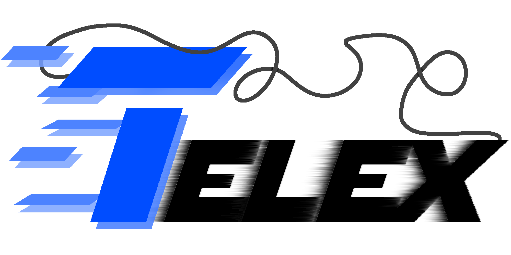

# Telex
Telex is a bot allows you to set up rooms that servers can connect to and chat across all connected servers.

Once the bot has joined a room, simply type in the assigned channel to transmit your message.
-

## Type `|room` to create a room and get started!

### Features included:
- Inviting servers
- Joining rooms
- Joined-server Management
- Announcements
- Inter-server polling